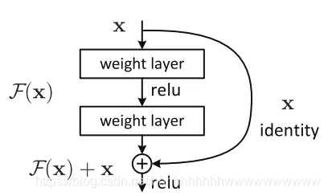
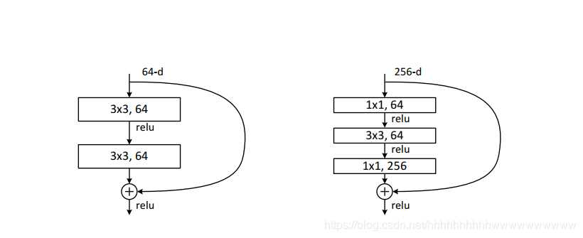
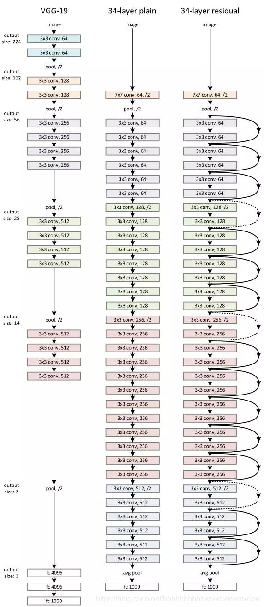
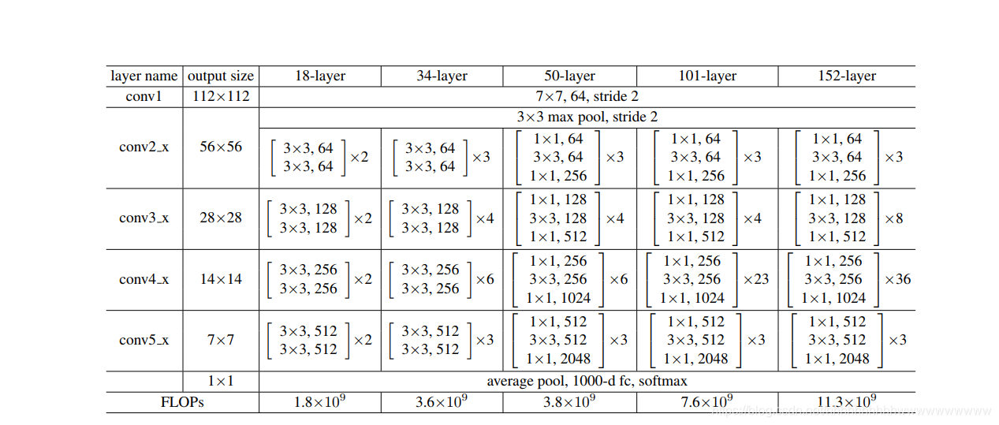

# ResNet学习

## ResNet基本思想

假设要学习的真实模型是h(**x**)。深度学习一般会想到使用f(**x**)直接近似h(**x**)，而残差网络通过观察到h(**x**)=**x**+(h(**x**)-**x**)，发现可以通过使用一个函数f(**x**)来近似残差h(**x**)-**x**从而近似h(**x**)，从而减小计算量。<br>
具体迭代公式即$\mathbf{x_i} = \mathbf{x_{i-1}} + f_i(\mathbf{x_{i-1}})$。

## ResNet模型架构

基本的模型架构如下：
<div align="center">
        
</div>

<div align="center">
        
</div>

<div align="center">
        
</div>

<div align="center">
        
</div>

## ResNet复现过程

### BasicBlock与BottleBlock

首先需要写两种残差单元，一种适用于层数较少的情况，一种适用于层数比较多的情况，分别为BasicBlock与BottleBlock。<br>
需要向残差单元中传入in_channel,out_channel,downsample,stride这四个参数，这四个参数的意义分别为：
| 变量名 | 含义 |
|-------|-------|
| in_channel | 输入通道数 |
| out_channel | 输出通道数 |
| downsample | 下采样函数 |
| stride | 卷积计算步长 |
同时每个残差单元还需要带一个expansion参数用来计算最终的输出通道数。<br>
最终两个残差单元的代码如下：

```python
# 定义resnet18与resnet34所需残差单元
class BasicBlock(nn.Module):
    expansion = 1

    def __init__(self, in_channel, out_channel, downsample=None, stride=1):
        super().__init__()
        # 第一层通过过滤器减半输入的图片样本通道数
        self.conv1 = nn.Conv2d(in_channels=in_channel, out_channels=out_channel,
                             kernel_size=3,stride=stride)
        # 对过滤后的图片样本进行BN处理
        # 输入参数为处理的通道数，由于是处理conv1中的数据，因此为out_channel
        self.bn1 = nn.BatchNorm2d(out_channel)
        # relu函数
        self.relu = nn.ReLU(inplace=True)
        # 第二层保持图片样本的通道数不变
        self.conv2 = nn.Conv2d(out_channel, out_channel)
        # 对第二层的通道数进行BN处理
        self.bn2 = nn.BatchNorm2d(out_channel)
        # 下采样调整输入样本x尺寸
        self.downsample = downsample
    
    # 对图片样本数据x进行残差映射
    def forward(self, x):
        identity = x
        # 需要进行下采样
        if(self.downsample!=None):
            identity = self.downsample(x)
        # 进行残差连接
        Fx = self.conv1(x)
        Fx = self.bn1(Fx)
        Fx = self.relu(Fx)
        Fx = self.conv2(Fx)
        Fx = self.bn2(Fx)
        # 残差与原来的值相加
        Fx += identity
        Fx = self.relu(Fx)
        return Fx

# 定义resnet50,101,152所需残差单元
class BottleBlock(nn.Module):
    expantion = 4

    def __init__(self, in_channel, out_channel, downsample=None, stride=1):
        super().__init__()
        # 第一层使用1x1的核函数
        self.conv1 = nn.Conv2d(in_channels=in_channel, out_channels=out_channel,
                               kernel_size=1, stride=1)
        self.bn1 = nn.BatchNorm2d(out_channel)
        # 保持输入通道数与输出通道数相等，按输入stride进行卷积运算
        self.conv2 = nn.Conv2d(in_channels=out_channel, out_channels=out_channel,
                               kernel_size=3, padding=1, stride=stride)
        self.bn2 = nn.BatchNorm2d(out_channel)
        # 第三层使用1x1的核函数并令输出通道数为out_channel*self.expantion
        self.conv3 = nn.Conv2d(in_channels=out_channel, out_channels=out_channel*self.expantion,
                               kernel_size=1, stride=1, bias=False)
        self.bn3 = nn.BatchNorm2d(out_channel*self.expantion)
        # relu函数
        self.relu = nn.ReLU(inplace=True)
        # 下采样函数
        self.downsample = downsample

    def forward(self, x):
        identity = x
        if(self.downsample!=None):
            identity = self.downsample(x)
        # 进行残差连接
        Fx = self.conv1(x)
        Fx = self.bn1(Fx)
        Fx = self.relu(Fx)
        Fx = self.conv2(Fx)
        Fx = self.bn2(Fx)
        Fx = self.relu(Fx)
        Fx = self.conv3(x)
        Fx = self.bn3(Fx)
        # 残差与原来的值相加
        Fx += identity
        Fx = self.relu(Fx)
        return Fx
```

然后就可以写残差网络函数了，具体的残差网络函数如下：

```python
class resnet(nn.Module):
    # block为残差单元，layers存储每层所需模块数量，in_channel为原始数据通过第一层，即7x7内核那一层后的通道数
    # numclasses为分类的种类数
    def __init__(self, block, layers, in_channel, numclasses=5):
        super().__init__()
        self.in_channel = in_channel
        # 初始图像数据为三通道数据，对应三原色
        self.conv = nn.Conv2d(in_channels=3, out_channels=in_channel,kernel_size=7,
                              stride=2,padding=3,bias=False)
        # bn处理
        self.bn = nn.BatchNorm2d(in_channel)
        # relu函数
        self.relu = nn.ReLU(inplace=True)
        self.layer1 = self._make_layer(block, 64, layers[0])
        self.layer2 = self._make_layer(block, 128, layers[1], stride=2)
        self.layer3 = self._make_layer(block, 256, layers[2], stride=2)
        self.layer4 = self._make_layer(block, 512, layers[3], stride=2)
        # max-pooling处理
        self.maxpool = nn.MaxPool2d(kernel_size=3, stride=2, padding=1)
        # avg-pooling处理
        self.avgpool = nn.AvgPool2d((1,1))
        # fc
        self.fc = nn.Linear(512, numclasses)

    def _make_layer(self, block, out_channel, block_num, stride):
        expansion = block.expansion
        downsample = None
        if(stride !=1 or self.in_channel != out_channel*expansion):
            # 下采样函数
            downsample = nn.Sequential(
                nn.Conv2d(in_channels=self.in_channel, out_channels=out_channel*expansion,
                          kernel_size=1,stride=stride,bias=False),
                nn.BatchNorm2d(out_channel*expansion)
            )

        layers = []
        # 一开始使用步长stride=2的模块使得数据大小减半，通道数加倍，同时设置好downsample函数
        layers.append(block(self.in_channel, out_channel*expansion, downsample, stride))
        # 到同一层的相同block的输入通道数变为out_channel*expansion
        self.in_channel = out_channel*expansion
        for _ in (1, block_num):
            # 之后上一层的输出作为下一层的输入，每一层保持输入通道数以及输出通道数不变
            layers.append(block(self.in_channel, out_channel))
        return nn.Sequential(*layers)
    
    # 进行训练
    def forward(self, x):
        x = self.conv(x)
        x = self.bn(x)
        x = self.maxpool(x)
        x = self.layer1(x)
        x = self.layer2(x)
        x = self.layer3(x)
        x = self.layer4(x)
        x = self.avgpool(x)
        x = x.reshape(x.size(0),-1)
        x = self.fc(x)
        return x
```
后续再更新...
